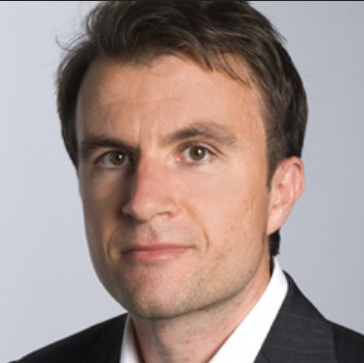
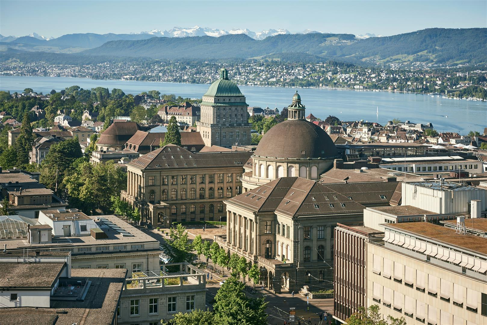



<!--
# {{ page.custom_page_title }}
-->

# Agriculture and geophysics:  Illuminating the subsurface!

<!--Getting precise about precision agriculture!-->

Agrogeophysics is an emerging research field. What are the current, potential and, future applications research needs? Come and discover with us!	

<!-- Book of abstracts: [download here](./media/AgroGeophysics_Seminar_Abstarct-Booklet.pdf) -->
	

  

## ETH Zürich, Switzerland 1st and 2nd February 2024

Want to join? [Register now](https://www.eventbrite.com/e/3rd-agrogeophysics-seminar-illuminating-the-subsurface-tickets-719678225947?aff=oddtdtcreator) and [submit an abstract](abstracts.html)!

**Deadlines**:
- 15th December 2023 (abstract submission)
- 12th January 2024 (registration)

## About this event

_After the success of the first edition ‘Geophysics & Agriculture: the perfect match?’ in 2020 and the second edition 'Agriculture and geophysics: an electrical meeting!' in 2022, we are pleased to give you all a new opportunity to exchange knowledge, good practices, and passion on current trending topics in agrogeophysics!_

Agrogeophysics harnesses geophysical methods such as ground-penetrating radar, electrical imaging, seismic,... from hand-held over drone to satellite-borne, to characterize patterns or processes in the soil-plant continuum of interest for agronomic management. These methods help develop sustainable agricultural practices by providing minimally-invasive, spatially consistent, multi-scale, and temporally-resolved information of processes in agro- ecosystems that is inaccessible by traditional monitoring techniques. The aim of this session is to feature applications of geophysical methods in agricultural research and/or show methodologies to overcome their inherent limitations and challenges. We welcome contributions monitoring soil or plant properties and states revealing information relevant for agricultural management; studies developing and using proximal or remote sensing techniques for mapping or monitoring soil-water-plant interactions; work focused on bridging the scale gap between these multiple techniques; or work investigating pedophysical relationships to better understand laboratory-scale links between sensed properties and soil properties and states of interest. Submissions dedicated to data fusion, utilizing innovative modeling tools for interpretation, and demonstrating novel acquisition or processing techniques are encouraged.

<!-- add about interactive session here? -->

## Invited talks

  

#### **Anja Klotzsche** | FZ Jülich, Germany
_"Potential of GPR for Agrogeophysics: Mapping and monitoring soil variables in different settings"_

#### **Kaijun Wu** | UCLouvain, Belgium
_"Drone-borne Ground Penetrating Radar for digital soil mapping"_

#### **Niklas Linde** | UNIL, Switzerland
_"Advances in Bayesian inversion methodologies with high potential value in agrogeophysics"_

#### **Adrian Flores-Orozco** | TU Wien, Austria
_"Delineation of organic carbon pools in subsoils through electrical methods"_

#### **Benjamin Mary** | ICA-CSIC, Spain
_"Monitoring and modelling root-zone processes with geoelectrical methods"_

#### **Myriam Schmutz** | Bordeaux INP, France
_"Overview of geoelectrical advances for vineyard study"_

 

<!-- <a class="btn btn-primary" href="program.html" role="button">See full program</a> -->

## Book of abstracts
Prepare your seminar experience with the [Book of abstracts](https://ilvo_plant-agrogeo24.curve.space/agrogeo24-book-of-abstracts).
Here you can also [download it as a PDF](media/booklet_of_abstracts.pdf)

## Practical information and registration

* **Registration** 
	- deadline: 12th January 2024 <!-- to be decided -->
	- fees: **free** for master students, **40** CHF for PhDs, **60** CHF for all other cases.

<!-- **30** CHF invited speakers, -->

* **Arrival + conference dinner:** Wednesday January 31st, 2024 - Social dinner in the evening (18:00)

* **Seminar days:**
  - Thursday February 1st, 2024 (8:30 - 18:00) - oral presentations (morning) and workshop (afternoon)
  - Friday February 2nd, 2024 - (8:30 - 18:00) - company fair, poster and end of workshop (morning) and oral presentations (afternoon)

* **After conference:**
  - Saturday February 3rd, 2024 - Ski trip (for those who want, not included in the fee)

## Location: ETHZ Zentrum Campus Zürich, Switzerland

<figure>
	
    <figcaption>ETHZ Zentrum Campus</figcaption>
</figure>

### How to get there

The conference will take place in the **Alumni Pavillon (MM C 78.1)** which is located at 12 minutes walk from Zürich main train station (Zürich HB).

<iframe src="https://www.google.com/maps/embed?pb=!1m18!1m12!1m3!1d5403.567780187057!2d8.538009094552871!3d47.37713624994071!2m3!1f0!2f0!3f0!3m2!1i1024!2i768!4f13.1!3m3!1m2!1s0x479aa15627cfce2f%3A0xd19bb48420ab467b!2sETH%20Alumni%20Pavillon!5e0!3m2!1snl!2sbe!4v1693406248738!5m2!1snl!2sbe" width="600" height="450" style="border:0;" allowfullscreen="" loading="lazy" referrerpolicy="no-referrer-when-downgrade"></iframe>

<!--
<iframe width="425" height="350" frameborder="0" scrolling="no" marginheight="0" marginwidth="0" src="https://www.openstreetmap.org/export/embed.html?bbox=4.362119436264039%2C50.84018189814839%2C4.368814229965211%2C50.84361336329293&amp;layer=transportmap&amp;marker=50.84189766226552%2C4.365466833114624" style="border: 1px solid black"></iframe> <small><a href="https://www.openstreetmap.org/?mlat=50.84190&amp;mlon=4.36547#map=18/50.84190/4.36547&amp;layers=T">Display map</a></small>
-->

### Accommodations
Here are three suggested hotels close to the venue:
- [Hotel Limmathof - Hotel Limmathof](https://limmathof.com/en/) (10 minutes walk to the venue, promo code: agrogeo24)
- [Hotel Felix | Zurich – centrally located in the heart of Zurich’s old town](https://www.hotelfelix.ch/) (8 minutes walk to the venue)
- [ibis Styles Zurich City Center | ALL - ALL (accor.com)](https://all.accor.com/hotel/B5J7/index.de.shtml) (12 minutes walk to the venue)
- [KRONE Zurich | Pop Up Hotel | Pop Up Hotel Krone Zurich](https://www.kronezurich.ch/) (9 minutes walk to the venue, promo code: AGROGEO24)

## Workshops

Three workshops will be proposed on the afternoon of the first day and morning of the second day:
- **Exploiting clustering algorithms for spatial analysis of geophysical data**
In this workshop, you will learn the tips and tricks on how to use centroid based clustering algorithms to analyse your spatial data. Using examples you will see how clustering can help to understand spatial patterns in several example datasets. The final example will show how clustering can combine data from different remotely sensed platforms. With the help of an online Jupyter notebook, you will also have the opportunity to try clustering on your data! Bring along some example dataset to try!

- **Introduction to SimPEG using an example with electrical resistivity tomography (ERT)**
Come and discover the powerful open-source SimPEG framework whose development is led by UBC. You will learn how to set-up an inversion in SimPEG using an example from ERT, then you will get the chance to set up an inversion scheme yourselves and finally get some information on how to proceed for your own data set. *Prerequisites: a bit of familiarity with Python and a Google colab account*.

- **OhmPi: an open-source resistivitymeter**
This workshop is divided in three parts where participants will be able to place components on the measurements board, assemble a multiplexer and program a raspberry pi to operate the system.

## Contact

Interested in participating? Get in touch! Pick the option that works best
for you.

<ul class="fa-ul my-5">
<li>
<i class="fa-li fa fa-envelope-open fa-fw" aria-hidden="true"></i>
Email <a href="mailto:abstracts.agrogeophy@gmail.com">abstracts.agrogeophy@gmail.com</a> or another <a href="committees.html">committee member</a> directly.
</li>
<li>
<i class="fa-li fab fa-slack fa-fw" aria-hidden="true"></i>
Find us on the <a href="https://join.slack.com/t/agrogeophy/shared_invite/zt-14x7c3h5f-_MziokBFPOrrFk2z2rRBIw">Agrogeophy</a> Slack (if it is the first time use this invitation link).
</li>
</ul>

 

<!--
## Sponsors

The seminar is supported by

<ul>
  <li> The <a href="http://www.soilbelgium.be/"> Soil Science Society of Belgium (SSSB) </a> – Topical committee II.Soil physics and hydrology </li>
  <li> ENVITAM doctoral school </li>
</ul>

     

-->

## Previous seminars

- 2020 <a href="http://www.soilbelgium.be/?p=3596">in Gembloux (Belgium)</a>
Geophysics conquering new territories: The rise of “agrogeophysics”

- 2022 <a href="https://agrogeophy.github.io/2nd_agrogeophysics_seminar">in Brussels (Belgium)</a>
Agriculture and Geophysics: An Electrical Meeting!

## Collaborations

We're always interested in new collaborations and interesting projects.
We'd love to hear from you if your project or idea could benefit from our
expertise in monitoring, data analysis, inverse problems, and research software
engineering.

**Reach out** to [our team](committees) to start a conversation!

## Sponsors

This event is supported by:

    

        
    

    

        
    

    

        
    

